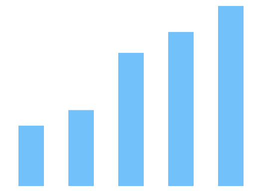
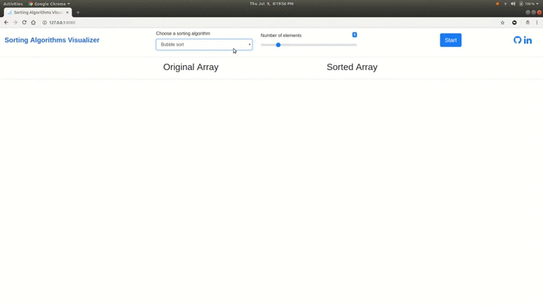

# Sorting-Algorithms-Visualization
 

  

  <h1 align="center">Sorting Algorithms Visualization</h1>

  

    Simple visualizer to help understand basic sorting algorithms! :D
     
  

## Demo

  
## Sorting Algorithms visualized:
* Bubble sort
* Optimized Bubble sort
* Selection sort
* Insertion sort
* Quicksort
* Heap sort

<!-- CONTACT -->
## Contact

Mugdha Bhagwat
[@mugdhabhagwat](https://www.linkedin.com/in/mugdhabhagwat/)

Project Link: [Sorting-Algorithms-Visualization](https://github.com/bhagwatmugdha/Sorting-Algorithms-Visualization)
